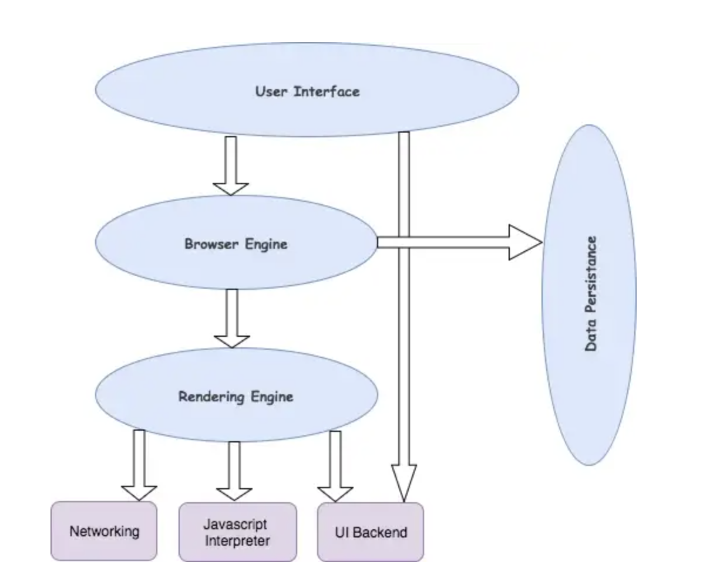
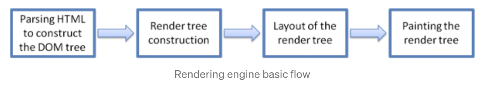
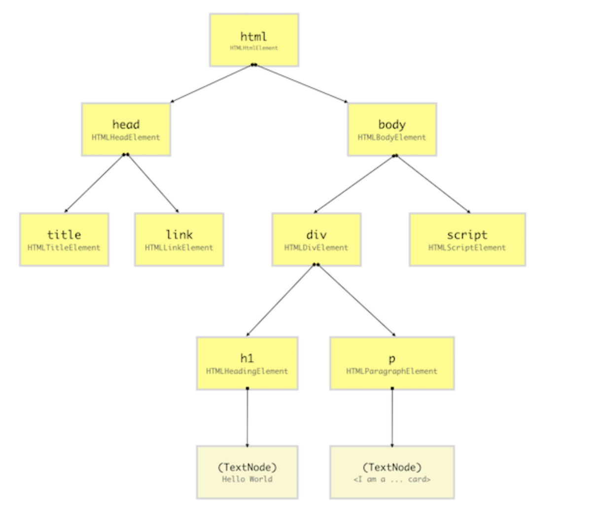

# 1. What is the main functionality of the browser?

The main functionality of a web browser is to render HTML, the code that is used to design web pages. When a browser loads a web page, it processes the HTML, which may contain text, links, and references to images and other items like CSS and JavaScript functions. The browser then renders these objects in the browser window after processing them.

When the web browser fetches data from an internet connected server, it uses a piece of software called a rendering engine to translate that data into text and images. This data is written in Hypertext Markup Language (HTML) and web browsers read this code to create what we see, hear and experience on the internet.

Hyperlinks allow users to follow a path to other pages or sites on the web. Every webpage, image and video has its own unique Uniform Resource Locator (URL), which is also known as a web address. When a browser visits a server for data, the web address tells the browser where to look for each item that is described in the html, which then tells the browser where it goes on the web page.

# 2. High Level Components of a browser

**The User Interface:** The user interface is the space where User interacts with the browser. It includes the address bar, back and next buttons, home button, etc.

**The Browser Engine:** The browser engine works as a bridge between the User interface and the rendering engine. According to the inputs from various user interfaces, it queries and manipulates the rendering engine.

**The Rendering Engine:** The rendering engine, as the name suggests is responsible for rendering the requested web page on the browser screen. The rendering engine interprets the HTML, XML documents and images that are formatted using CSS and generates the layout that is displayed in the User Interface.

**Networking:** Component of the browser which retrieves the URLs using the common internet protocols of HTTP or FTP. The networking component handles all aspects of Internet communication and security.

**JavaScript Interpreter:** It is the component of the browser which interprets and executes the javascript code embedded in a website. The interpreted results are sent to the rendering engine for display. If the script is external then first the resource is fetched from the network. Parser keeps on hold until the script is executed.

**UI Backend:** UI backend is used for drawing basic widgets like combo boxes and windows. This backend exposes a generic interface that is not platform specific. It underneath uses operating system user interface methods.

**Data Persistence/Storage:** This is a persistence layer. Browsers support storage mechanisms such as localStorage, IndexedDB, WebSQL and FileSystem. It is a small database created on the local drive of the computer where the browser is installed. It manages user data such as cache, cookies, bookmarks and preferences.

# 3. Rendering engine and its use

The networking layer will start sending the contents of the requested documents to the rendering engine in chunks.

The rendering engine parses the chunks of HTML document and converts the elements to DOM nodes in a tree called the “content tree” or the “DOM tree”. It also parses both the external CSS files as well as style elements.

While the DOM tree is being constructed, the browser constructs another tree, the render tree. This tree is of visual elements in the order in which they will be displayed. It is the visual representation of the document. The purpose of this tree is to enable painting the contents in their correct order.

# 4. Parsers (HTML, CSS, etc)

Parsing is the process of reading HTML content and constructing a DOM tree from it. Hence the process is also called DOM parsing and the program that does that is called the DOM parser.

HTML Parser - The job of the HTML parser is to parse the HTML markup into a parse tree.

Similar to HTML parsing, CSS parsing also starts by tokenizing the CSS source code into tokens, which are then parsed into CSS rules. Further, CSSOM is rendered.

# 5. Script Processors

The script processor executes Javascript code to process an event. The processor can be configured by embedding Javascript in your configuration file or by pointing the processor at external file(s).

# 6. Tree construction

While the DOM tree is being constructed, the browser constructs another tree, the render tree. This tree is of visual elements in the order in which they will be displayed. It is the visual representation of the document. The purpose of this tree is to enable painting the contents in their correct order.Each renderer represents a rectangular area usually corresponding to a node's CSS box.It includes geometric information like width, height and position.

The renderers correspond to DOM elements, but the relation is not one to one. Non-visual DOM elements will not be inserted in the render tree. An example is the "head" element. Also elements whose display value was assigned to "none" will not appear in the tree (whereas elements with "hidden" visibility will appear in the tree).

There are DOM elements which correspond to several visual objects. These are usually elements with complex structure that cannot be described by a single rectangle. For example, the "select" element has three renderers: one for the display area, one for the drop down list box and one for the button. Also when text is broken into multiple lines because the width is not sufficient for one line, the new lines will be added as extra renderers.

# 7. Order of script processing

Loading order: introducing the order in which tags < script /> appear,
The Javascript code on the page is part of the HTML document, so the order in which Javascript is loaded is the order in which the tag < script /> appears, and the external JS in the < script /> tag or introduced through src is executed in the order in which the statement appears, and the execution process is part of the document
Global variables and functions defined by each script can be invoked by subsequent scripts.
Variable calls must be declared previously, otherwise the value of the variable obtained is undefined.
In the same script, function definitions can appear after function calls, but if they are in two separate sections of code and function calls are in the first section of code, an undefined function error will be reported.
document.write() writes the output to the location of the script document. After the browser parses the content of the document where documemt.write(), it continues to parse the content of the document.write().Then proceed to parse the HTML document.
Execution order of JS function with the same name

# 8. Layout

The first browser creates the layout of each individual Render-Tree node. The layout consists of the size of each node in pixels and where (position) it will be printed on the screen. This process is called layout since the browser is calculating the layout information of each node.

This process is also called reflow or browser reflow and it can also occur when you scroll, resize the window or manipulate DOM elements. Here is a list of events that can trigger the layout/reflow of the elements.

# 9. Painting

In this phase, layers are created. Creating layers helps the browser efficiently perform painting operations throughout the lifecycle of a web page such as while scrolling or resizing the browser window. Having layers also helps the browser correctly draw elements in the stacking order (along the z-axis) as they were intended by the developer.

Now that we have layers, we can combine them and draw them on the screen. But the browser does not draw all the layers in a single go. Each layer is drawn separately first.

Inside each layer, the browser fills the individual pixels for whatever visible property the element has such as border, background color, shadow, text, etc. This process is also called rasterization. To increase performance, the browser may use different threads to perform rasterization.
